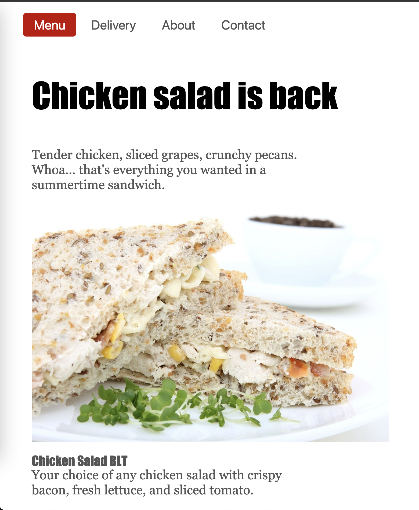

# Restaurant Page web presentation

> This is the simple project for restaurant page build by using the Single Page Application (SPA) approach with vanilla JavaScript.

## Built With

- Java Script

## Local development prerequisite

- Node and npm

## Setting up on your machine

Clone this repository to your computer by executing the command git clone git@github.com:marijanbrvar/RestaurantPage.git && cd RestaurantPage

Run `npm install` and then use script `npm run serve` to start the local server for development.

Open locally cloned code in your favorite code editor.

Feel free to adapt, improve or change everything.

## Live Demo

[Live Demo Link](https://marijanbrvar.github.io/RestaurantPage/)

## Author

👤 MARIJAN BRVAR

- GitHub: [@githubhandle](https://github.com/marijanbrvar)
- Twitter: [@twitterhandle](https://twitter.com/marijanbrvar)
- LinkedIn: [LinkedIn](https://linkedin.com/in/marijanbrvar)

## 🤝 Contributing

Contributions, issues, and feature requests are welcome!

Feel free to check the [issues page](https://github.com/marijanbrvar/RestaurantPage/issues).

## Show your support

Give a ⭐️ if you like this project!

## 📝 License

This project is [MIT](https://github.com/marijanbrvar/RestaurantPage/blob/feature/LICENSE) licensed.
